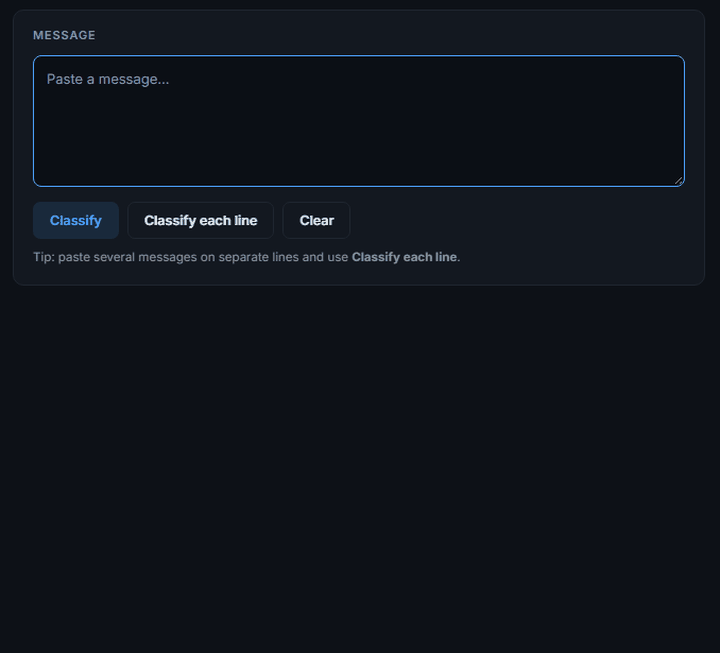

# AI Spam Message Classifier

[](https://github.com/luke-zhang-cs-py/AI-Spam-Message-Classifier/actions/workflows/python-package.yml)
[](LICENSE)
[](https://www.python.org/)

Spam or not — and, more usefully, **which words drove that call**.

### ▶ [Paste a message and see →](https://luke-zhang-cs-py.github.io/AI-Spam-Message-Classifier/app/)
Runs in your browser with the trained model exported into the page. No install,
nothing uploaded.



*The last one is the point: `80086` becomes `shortcodetoken`, so the model keys
on the **shape** of a short code rather than memorising that one number.*

**[Read the full write-up →](https://luke-zhang-cs-py.github.io/AI-Spam-Message-Classifier/)**
— the result and the four reasons to read it carefully, and every bug this has
had. (Or open [`docs/index.html`](docs/index.html) locally.)

## How it works

```
message -> clean_text() -> TF-IDF (1-2 grams) -> classifier -> threshold -> spam | ham
```

1. **Normalise.** Fold case, then replace each noisy part with a token for its
   *kind*: `urltoken`, `moneytoken`, `shortcodetoken`, `phonetoken`,
   `allcapstoken`. An earlier version deleted them, which is ordinary advice
   for topic classification and close to backwards here — in "text WIN to
   80086" the short code *is* the evidence, and deleting it leaves "text WIN
   to". Keeping the shape and dropping the specifics moved F1 from 0.768 to
   0.784.
2. **Features.** TF-IDF over unigrams and bigrams, sublinear, no stop-word
   list: "free", "win" and "call" are the signal here, not noise to strip.
3. **Model.** MultinomialNB, ComplementNB and LogisticRegression compared with
   `cross_val_predict`, so no message is scored by a fold that trained on it.
   One split moves F1 by several points on a corpus this size, and choosing a
   model on that is choosing a split.
4. **Threshold.** The cut with the best F1 whose precision stays at or above
   0.90. Predicting at 0.5 leaves the most consequential dial untouched:
   blocking a real message costs the reader something they wanted, missing a
   scam costs them an annoyance. The cut is wrapped into the model, so a saved
   artifact can't forget the one it was chosen with.

## Run it

```bash
pip install -r requirements.txt

python app.py                                                  # web UI, port 5002
python -m cli.train_spam_classifier                            # train + evaluate
python -m cli.classify "Congratulations! You've won a free prize"  # one message
```

`pipeline/spamlib.py` is the one implementation; the CLI and the Flask app are
entry points to it. They used to be three copies with a test asserting the
copies agreed — which kept them in step without ever reducing how many there
were.

```
pipeline/   spamlib.py       the filter: cleaning, features, training,
            embeddings.py    prediction, and the optional transformer
cli/        classify.py      train it, then ask it about a message
            train_spam_classifier.py
app.py      the web UI
spam_classifier_all_in_one.py
            the copy-out-and-run demo, which app.py imports
data/       the corpus, one CSV per theme
dataset.csv the older single file, read only when data/ is absent
```

The two files still at the root are there on purpose. The all-in-one exists
to be one file somebody can lift, and burying it would defeat that;
`dataset.csv` is the fallback for a checkout without `data/`, so moving it
into `data/` would make it unreachable by definition.

## Results

412 messages (233 ham, 179 spam), scored **out of fold** — every probability
comes from a fold that did not train on the message it scores.

| Model | Cut | Accuracy | Precision | Recall | F1 |
|---|---|---|---|---|---|
| Multinomial Naive Bayes | 0.4559 | 0.876 | 0.900 | 0.804 | **0.850** |
| Complement Naive Bayes | 0.5222 | 0.876 | 0.900 | 0.804 | 0.850 |
| Logistic Regression | 0.4681 | 0.820 | 0.901 | 0.659 | 0.761 |

**Read precision carefully.** Every row sits at almost exactly 0.900 because
that's the floor the threshold was chosen against — not because four models
independently arrived at the same precision. Reading it as an achievement is a
category error.

## The browser build

```bash
python tools/build_static.py           # writes docs/app/
python tools/build_static.py --prove   # checks that the checks can fail
```

[`docs/app/`](docs/app/) is the same page with the fitted model exported into
it — the full 4,479-term vocabulary, both rows of `feature_log_prob_` and the
decision threshold, nothing pruned or rounded. `templates/index.html`,
`style.css` and `app.js` are copied byte for byte; what's added is the scoring
path ported to JavaScript. **Inference only** — training needs scikit-learn and
the corpus, so Retrain is disabled there.

A second implementation of the scoring code that nothing in `tests/` ever loads
is exactly where a quiet divergence would hide, so the build runs both over 556
messages (the whole corpus plus 144 deliberately awkward ones — empty, control
characters, Unicode digits, emoji) and compares the cleaned string, the
probability to 1e-12, the verdict, and **every token weight in display order**.
One disagreement and nothing is written.

`--prove` sabotages the published model six ways and requires each to be
caught. That earned its keep immediately: the first version **failed it** —
moving the threshold by 0.02 flipped no verdict, because nothing in 556
messages landed that close to the cut. The check was testing the arithmetic but
never the number it compares against. There's a pass for that now.

## Tests

```bash
pytest -q
```

138 tests, 100% of 525 statements — and those figures are checked against the
repo, because a number typed into a file goes stale the moment a test is added.

## License

[MIT](LICENSE) — see [CONTRIBUTING.md](.github/CONTRIBUTING.md) for setup and conventions.
